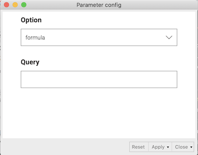

KNIMEのワークフローを運用する上で、ノードの設定にパラメータ(変数)を持たせておいて状況に応じて変更したいケースがあります。

- フィルターの閾値を調整してデータセットのサイズを変えたい
- 機械学習のパラメータを変更してパフォーマンスを比較したい
- REST APIのユーザ認証情報やクエリをその都度変更したい

それぞれのノードの設定パラメータをその都度変更することは大きな苦痛を伴います。そのような場合、コンポーネントにパラメータ設定ノードをまとめることでパラメータの管理が楽になります。

### 環境

- MacOS 10.15.7
- KNIME 4.2.2

### やりたいこと

KEGG APIに投げるGETリクエストのパラメータをコンポーネントで管理します。

KEGG API  
https://www.kegg.jp/kegg/rest/keggapi.html

KEGGデータベースを検索するfindコマンドを使用し、分子量や分子式が条件に合致した化合物のレコードを返すクエリを発行し、データを取得します。

- 分子式に少なくともC7H10O5を含む化合物のリストを取得する

  http://rest.kegg.jp/find/compound/C7H10O5/formula

- 精密質量が四捨五入して174.05になる化合物のリストを取得する

  http://rest.kegg.jp/find/compound/174.05/exact_mass

- 分子量が300から310の範囲にある化合物のリストを取得する

  http://rest.kegg.jp/find/compound/300-310/mol_weight

このように、化合物リストを取得するクエリはhttp\://rest.kegg.jp/find/compound/<値(の範囲)>/<検索対象>という形式になっているので、後半部分をパラメータ化して自由に値を変更できるようにします。

### ワークフローの設計

1. 入力形式に対応したConfiguration NodeをコンポーネントにまとめてFlow Variableポートを接続し、フロー変数を流す
1. String Manipulation (Variable) Nodeを接続し、クエリ文字列を作成
1. GET Request Nodeを接続し、リクエストを発行してレスポンスを受け取る

クエリのパラメータですが、上記クエリ例のformula(分子式)、exact\_mass(精密質量)、mol\_weight(分子量)のいずれかをドロップダウンで選択できるようにします(フロー変数名optionとします)。

値の部分はC7H10O5(文字列)、174.05(不動小数点)、300-310(範囲)など様々な形式を取りうるので、とりあえず文字列入力とします(フロー変数名queryとします)。

上記フローのコンポーネントノードParameter configをダブルクリックすると下図のようなダイアログが出てきて、クエリパラメータを設定できるようにするのが目標です。

### メタノードとコンポーネント

メタノードとコンポーネントの違いは下記公式ブログに説明があります。

https://www.knime.com/blog/metanode-or-component#:~:text=A%20component%20can%20encapsulate%20flow%20variables&text=Figure%202.,No%20barriers%2C%20no%20limits.

ざっくりまとめると以下のようになります。

- メタノードは一連のワークフローを一つのノードに集約する。これにより複雑なワークフロー全体の見通しをよくし、使用頻度の高いルーチンの再利用を促す。
- コンポーネントはメタノードの機能に加えて以下の機能を持つ。
  - フロー変数を遮蔽する(コンポーネント外部からフロー変数を参照できなくする)。これにより、グローバルな変数が増えて変数名が衝突し意図しないバグが発生することを避けることができる。
  - ウィジェット(Widget)ノード、設定(Configuration)ノードをコンポーネントにまとめることで、それらの入出力インターフェースを統合してノード設定ダイアログやインタラクティブビューに配置できる。

フロー変数を使用する場合は原則コンポーネント、そうでない場合(ただ増えすぎたノードをまとめてスッキリしたい場合など)はどちらでも良いということになります。

### ウィジェットノード(Widget Node)と設定ノード(Configuration Node)

以前のバージョンではQuickformsとして知られていたノード群です。Quickformsは既にdeprecatedで、KNIME4.2では用途によってウィジェットノードと設定ノードを使い分ける形式になっています。これらはどちらも数値入力やドロップダウンなどUI部品を持ち、入出力をフロー変数で流すことのできるノードです。

- ウィジェットノードはWebベースのインタラクティブビューを出力するので、レイアウトやCSSをカスタマイズすることができます。これは商用のKNIME Serverを想定した仕組みで、ワークフローのWebアプリケーション化を可能にします。

- 一方、設定ノードはウィジェットのようなビューを生成しませんが、ノード設定ダイアログに入力フォームを集約できるので、パラメータだけ管理したい場合はこちらの方が便利です。

### ワークフローの作成(設定ノードの場合)

#### コンポーネントの作成

今回はドロップダウンと文字列入力のフォームが欲しいので、Single Selection ConfigurationノードとString Configurationノードをワークスペースに配置します。Node Repositoryウィンドウから検索するか、Workflow Abstraction -> Configurationから選択します。

設定ノードをまとめて選択して、右クリックメニューからCreate componentを選択します。名前の入力を求められるので、今回は「Parameter config」とします。

Parameter configという灰色のコンポーネントノードが作成されました。右クリックメニューでComponentを選択するとコンポーネントの操作コマンドが表示されます。

- Open - コンポーネントのワークスペースウィンドウを開き、コンポーネント内のノードを編集する
- Expand - コンポーネントを分解して現在のワークスペースに配置する
- Setup - コンポーネントに接続するポートを設定する
- Convert to metanode - コンポーネントをメタノードに変換する
- Share以下のコマンドはおそらくKNIME ServerのWebPortal用

#### 設定ノードの設定

Component->Setupを選択し、コンポーネントに接続するポートを設定します。このコンポーネントにデータフローの入力はないので、In Portsはそのままにしておきます。設定ノードで指定した値をフロー変数として下流に流すので、OutPortsのAddを選択し、Port TypeでFlow Variableを設定します(下図は設定後のダイアログ)。コンポーネントの右側にFlow Variableポートの赤い丸が表示されます。

次に、Component->Openを選択し、コンポーネント内の設定ノードを編集します。新しいタブが開き、コンポーネント内のノードが表示されます。

Single Selection Configurationノードをダブルクリックして設定を開きます。設定が必要な項目は以下の通りです(設定値は下図参照)。

- Label - フォームのラベル
- Parameter/Variable Name - 設定ノードで入力した値を格納するフロー変数の名前
- Selection Type - フォームの見た目をラジオボタン、リスト、ドロップダウンから選択
- Possible Choice - 選択肢の項目(改行区切り)
- Default Value - Possible Choiceで作成したリストから１つデフォルト値を選択

同様にString Configurationノードも設定します。以下のように設定しました。

- Label -> Query
- Parameter/Variable Name -> query
- Default Value -> C6H12O6

#### コンポーネント内のノードの接続

Flow variableポートの赤丸をドラッグして下図の様に接続します。今回上流ノードは想定しないので、Component Inputは孤立していて大丈夫です。

Component Outputをダブルクリックして設定ダイアログを開きます。上記フローが正しく設定されていると、Excludeのところにフロー変数のリストが表示されます。下流ノードで使用する変数queryとoptionをIncludeの方に移動します。

ここまで設定したら親ワークフローに移動して、Parameter configコンポーネントをExecuteしてみます(正しく設定されていればシグナルが緑になります)。コンポーネントノードの設定を開くと、設定ノードで作成したフォームにデフォルト値が入力されています。

設定ノードのコンポーネントはウィジェットと異なり現状レイアウト変更ができません。フォームの項目の順番はノードの作成順(メニュー -> Node -> Show Node IDsで確認可能)になるので、古いノードをコピーして新しくノードを作り直すという方法で一応並べ替えが可能です。issueは上がっているので今後変更できる様になるかもしれません。

Feature request: change order of configuration parameters in component  
https://forum.knime.com/t/feature-request-change-order-of-configuration-parameters-in-component/23574

#### クエリURLの作成

設定ノードのコンポーネントで入力したフロー変数を利用してクエリURLを作成します(Parameter configコンポーネントを右クリック->Outport 1を選択して、フロー変数の値が入力されていることを確認してください)。

Node RepositoryウィンドウからString Manipulation (Variable)ノードをワークフローに配置し、コンポーネントのFlow variableポートからString Manipulation (Variable)ノードのポートに接続します。

String Manipulation (Variable)の設定ダイアログを開くと、左側にフロー変数のリストが表示されているはずです。項目をダブルクリックするとExpressionのところにフロー変数が挿入されるので、これを使用してクエリURLを作成していきます(下図例)。Expressionで使用できる関数のリストがFunctionのところにあり、説明を見ることができます。今回、文字列に変数をinterpolateする方法が分からなかったので全てjoinで連結しました。

ダイアログ下部のAppend Variableで変数名を入力し、作成した文字列を新しいフロー変数として下流に流します。String Manipulation (Variable)をExecuteして右クリック-> Appended variablesを開くと、クエリURLが新しいフロー変数として格納されています。

#### GETリクエストの発行

Node RepositoryウィンドウからGET Requestノードを検索してワークスペースに配置します。String Manipulation (Variable)のフロー変数ポートからGET Requestのフロー変数ポートに接続します(赤丸をポートではなくGET Requestノードそのものにドラッグします。カーソルが電源プラグになります)。

設定ダイアログを開き、上部タブのFlow VariablesからConstantURIのドロップダウンでquery_url（クエリURLが格納されたフロー変数）を選択します。本来この項目はConnection SettingsのURLで指定するのですが、Flow Variablesが束縛されているとそちらを優先します(ダイアログ下部にThe "Constant URI" parameter is controlled by a variable.という警告があります)。

GET RequestノードをExecuteして右クリックメニューからGET resultsを開くと、取得したレスポンスが表示されます。KEGG APIは平文テキストを返すAPIなので、下流でテキストをパースしてテーブルに変換し解析するという流れになります。

### ウィジェットノードのコンポーネントを作成する

ウィジェットノードの場合も設定ノードと全く同じ流れになります。String Configuration -> String Widgetのようにそれぞれの設定ノードに対応したウィジェットノードを使用します。

ウィジェットで構成されたコンポーネントは、ダブルクリックで設定ダイアログが開かず、代わりに右クリックメニューからInteractive viewを開くことができます。

また、設定ノードと大きく異なる点として、コンポーネントのワークスペース編集時にメニュー -> Node -> Component Usage And Layoutからフォームのレイアウトを編集することができます。

また、CSS設定ノードからフロー変数を流して見た目を変えることができるようです(KNIME Server向けの機能)。

### Tips

#### 設定項目が多い場合

設定項目が多い場合、設定ノードやウィジェットを直列に接続するとワークフローの見通しが悪くなり、項目の追加・削除が難しくなります。Merge Variablesノードを使うことで、フロー変数を並列にまとめることができます。Merge Variablesをカスケードすることで設定項目のグループごとにフロー変数をまとめることもできます。Merge Variablesのデフォルト入力ポートは２つですが、ノードアイコン左下の・・・をクリック->Add Input Portで増やすことができます。

#### ログイン情報(クレデンシャル)を使用する

Credentials Configuration/Widgetノードを配置することでログインユーザ名、パスワードのセットをフロー変数として流すことができます。これは特殊なフロー変数で、通常のノード設定からは参照することができません。

上述のGET Requestノードはクレデンシャルを扱うことができます。設定ダイアログ上部タブのAuthenticationでユーザ認証のタイプを指定し、Credentialsにチェックを入れ、上流のCredentials Configuration/Widgetノードから流れてきたクレデンシャルフロー変数を指定します(下記図)。

