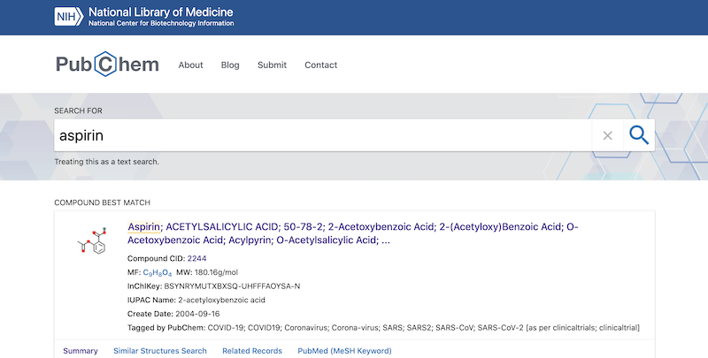

ある試薬を購入したい時(あるいは購入可能かどうか知りたい時)、我々は試薬メーカーのオンラインカタログにアクセスして目的の試薬を検索します。また、発見した化合物が既に報告されていないか確認するために、文献データベースにアクセスして、関連する文献の情報を収集します。このように、化学に携わる人々は、日常の業務において何らかの化学情報に関わっています。


### 化学のデータを扱う研究分野

- ケモインフォマティクス(Chemoinformatics, Cheminformatics, 化学情報学)

  化学の課題に情報学的手法で取り組む情報学の一分野です。化学データベースの構築、化学構造検索、化学データの記述法と標準化、化学構造データの可視化などが主なテーマです。歴史的にはシード/リード探索のために膨大な数の化合物を取り扱う必要があった創薬と密接な関係のある分野です。スクリーニングに用いる化合物ライブラリの設計、数理モデルに基づく生理活性や薬物動態の予測、創薬化学の基礎概念である構造活性相関(Structure activity relationship)など、創薬の実務に広く応用されています。

- 計算化学 (Computational chemistry)

  コンピュータの補助により物理化学の数値計算を行う理論化学の一分野です。分子軌道法による分子の電子状態および反応機構の解明、分子動力学法による相互作用のシミュレーション等に取り組みます。扱うモデルが理論化学モデル(量子、熱力学)である点でケモインフォマティクスと区別されますが、明確な境界は無くなってきています。

- ケミカルバイオロジー: 化学物質が生体に及ぼす作用を利用して生命現象を解明する研究分野です。創薬と同様に分子探索スクリーニングや情報学的手法も駆使して研究の鍵となる化学物質(プローブ)を特定します。
- メタボロミクス: 分析技術の発達により検出できる化合物数が飛躍的に増加したため、統計解析や機械学習を駆使したデータマイニングが重要になってきました。
- マテリアルズインフォマティクス: 分子探索の手法を応用して効率的かつ系統的な材料探索手法を確立する研究が進められています。


### 化学データベース

化学データベースの例としては、各国の研究機関が運営している医薬品・創薬候補化合物データベースや、試薬メーカーのオンラインカタログなどがあります。

- [PubChem](https://pubchem.ncbi.nlm.nih.gov/) アメリカ国立衛生研究所(NIH)が運営、医薬候補化合物とその活性データ
- [ChEMBL](https://www.ebi.ac.uk/chembl/): 欧州バイオインフォマティクス研究所(EBI)が運営、医薬候補化合物とその活性データ
- [DrugBank](https://www.drugbank.ca/): 承認薬
- [ZINC](http://zinc.docking.org/): 医薬候補化合物のうち入手可能な市販試薬
- [シグマアルドリッチジャパン](https://www.sigmaaldrich.com/japan.html): 試薬メーカーのオンラインカタログ
- [東京化成工業(TCI)](https://www.tcichemicals.com/JP/ja/): 試薬メーカーのオンラインカタログ


ここではPubChemを例に挙げます。


PubChemにアクセスし、検索窓に化合物名を入力して検索します(検索窓の下に表示されている検索クエリの例を試すことができます)。検索にヒットしたレコードを選択すると、化学構造や物性などの詳細なデータが表示されます。



化学データベースのレコードは、以下のような情報で構成されます。

- 化学式

  分子がどの元素で構成され、それぞれの原子と原子の間にどのような化学結合があり、どのような位置関係になっているか。構造式、分子式、組成式など。

- 物性

  化合物が示す性質。実験によって得られた、あるいは計算によって予測された、沸点、融点、分配係数(水、油への溶けやすさ)、旋光度、モル質量、光学スペクトルなど。

- 名前、識別子

  化合物の名前、あるいは化学データベースにおいて化学物質を識別するID。歴史的経緯により広く用いられている慣用名、一定の命名規則に従ってつけられる系統名、Chemical Abstract Serviceに登録された化合物のIDであるCAS番号など。

- 生理活性

  化合物が生体にどのような影響を与えるか。薬効や毒性の強さ、その作用機序など。

- 安全性、法規制

  化合物の毒性、腐食性、可燃性、環境への負荷等、化学物質が生物および社会に与える影響に関する情報。およびそれらの懸念により化学物質の所持、譲渡、使用に際して課せられる法的な制限。


### 構造検索と分子のトポロジー

多くの化学データベースには、化学構造による検索機能が実装されています。例えばPubChemの場合、検索窓の下にあるDraw structureのアイコンから構造式エディタを開き、描画した構造式と完全に（あるいは部分的に)一致する化合物を検索することができます。


化学構造の一致をコンピュータで検出することは見た目ほど単純ではありません。分子の構造は原子の数と種類だけで決まるものではなく、原子と原子の結合の仕方によって様々な形状をとるからです(下記は、C5H10の分子式を持ついくつかの分子の例)。


このような環状構造や分岐構造など、物体が持つ形状の概念を数学の用語でトポロジー(topology)と呼びます。

💡<span class="tip">構造異性体(structural isomer)とは、ある分子と分子式が同じ(化合物を構成する元素の種類と数が同じ)であり、かつトポロジーが異なる分子のことです。上図の分子は全て互いに構造異性体の関係にあります。</span>

分子の構造の(部分)一致を検出する最も確実な方法は、分子のトポロジーのみを抽出したグラフというデータ構造を用いて、(部分)グラフ同型かどうかを判定することです。下図のように、2つのグラフが部分的に一致する範囲を徐々に広げながら探索するアルゴリズムを用います。


情報学の研究テーマの一つであるグラフ理論では、グラフとそれに関連するアルゴリズムを取り扱います。グラフ理論には、上記の例のように分子のトポロジーの取り扱いに応用できる概念やアルゴリズムが数多く存在します。


### データファイル形式

前述のPubChemの構造検索画面でExportの右のドロップダウンメニューを開くと、いくつかの共通データ形式のリストが表示されます。これらのデータ形式のファイルを保存することにより、描画した構造式をほかの構造式エディタや化学データベースソフトウェアなどでも利用することができます。

特によく利用されるデータ形式のうち2つを以下に挙げます。


#### SMILES

SMILESは文字列による化学構造式の表記法です。表記ルールが非常にシンプルなため、パーサの実装が容易で、かつ可読性が高いことが特徴です。SMILESに慣れると簡単な構造であれば構造式エディタが無くても検索クエリが打てるようになります。SMILESの拡張仕様であるSMARTSを利用すれば、AND/OR条件などを含む複雑なクエリも作成可能です。

よく知られている仕様は[Daylight社が公開](https://www.daylight.com/dayhtml/doc/theory/theory.smiles.html)しているものです。他にも[OpenSMILES](http://opensmiles.org/opensmiles.html)というオープンソースの仕様があります。

SMILESでは、分子グラフのトポロジーを以下の3種類の記法のみで表現します(逆に、その3種類のみで全て表現できるということでもあります)。

- 直鎖

  SMILESの基本構造である元素記号の列は、それらが直鎖状に結合していることを表します。

- 分岐

  `(`と`)`で囲まれた部分が分岐です。同じ原子から２つ以上の分岐がある場合は括弧を続けて並べます。

  

- 環

  環の接合部分を数字のラベルで表します。縮合環ではそれぞれの接合部分を異なる数字で表します。

  


#### MDL Molfile

Chemical table file (CT file)というデータ形式の一種です。Molfileに化合物名や物性などのフィールドを付与してフラットファイルデータベースにしたものがSDfile(拡張子.sdf、しばしばSDF形式と呼ばれる)で、試薬カタログ等の化合物データベースのデファクトスタンダードとなっています。

仕様の概要については[[Chemical table file - Wikipedia]](https://en.wikipedia.org/wiki/Chemical_table_file)参照、詳細な仕様については[BIOVIAのサイト](https://www.3ds.com/ja/products-services/biovia/)からダウンロードできます(要登録)。

📗<span class="note">かつてMolecular Design Limited (MDL)という企業が作成したデータ形式ですが、仕様が公開され広く普及しています。いくつかバージョンが存在し、特にV2000というバージョンが多くのソフトウェアで利用可能です。</span>

Chemical table fileという名の通り、原子、結合、プロパティそれぞれの一覧表(ブロック)から構成されているため、パーサの実装は極めて容易です。また、原子のテーブルには座標の情報が格納されているので、2次元、3次元空間に描画された化学構造式の見た目の印象を保持することができるのが特徴です。

```{numberLines: true}
 
  MJ201100                      

  6  6  0  0  0  0  0  0  0  0999 V2000
   -2.9241   -0.2910    0.0000 C   0  0  0  0  0  0  0  0  0  0  0  0
   -3.6385   -0.7035    0.0000 C   0  0  0  0  0  0  0  0  0  0  0  0
   -3.6385   -1.5286    0.0000 C   0  0  0  0  0  0  0  0  0  0  0  0
   -2.9241   -1.9411    0.0000 C   0  0  0  0  0  0  0  0  0  0  0  0
   -2.2096   -1.5286    0.0000 C   0  0  0  0  0  0  0  0  0  0  0  0
   -2.2096   -0.7035    0.0000 C   0  0  0  0  0  0  0  0  0  0  0  0
  1  2  2  0  0  0  0
  2  3  1  0  0  0  0
  3  4  2  0  0  0  0
  4  5  1  0  0  0  0
  5  6  2  0  0  0  0
  6  1  1  0  0  0  0
M  END
```

- 1-3行目: ヘッダーブロック。ファイルを生成したソフトウェアの情報などが記載される
- 4行目: カウント行。原子のレコード数、結合のレコード数、...の順
- 5-10行目: 原子ブロック。x座標、y座標、z座標、元素記号、...の順
- 11-16行目: 結合ブロック。原子1のインデックス、原子2のインデックス、結合次数、...の順。
- プロパティブロック(電荷、ラジカル、同位体など)がある場合、結合テーブルの下に記載される
- 17行目: 終端行

Molfileでは、結合ブロックにおいて結合の両端の原子のインデックス(その原子が原子ブロックの上から数えて何行目にあるか）を記述することで分子のトポロジーを表現します。


[[化学構造とグラフ理論 目次]](../molecular-graph-toc)
