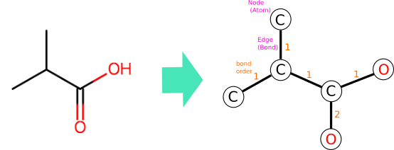
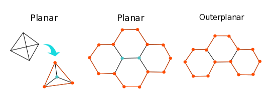

### 分子グラフモデル

分子のトポロジーを表現するデータ構造として、分子グラフ(molecular graph)がしばしば用いられます。ここで言うグラフとは、頂点(ノード、node)とそれらを結ぶ辺(エッジ、edge)から構成されるデータ構造のことです。

グラフ(データ構造) - Wikipedia  
[https://ja.wikipedia.org/wiki/%E3%82%B0%E3%83%A9%E3%83%95_(%E3%83%87%E3%83%BC%E3%82%BF%E6%A7%8B%E9%80%A0)](https://ja.wikipedia.org/wiki/%E3%82%B0%E3%83%A9%E3%83%95_(%E3%83%87%E3%83%BC%E3%82%BF%E6%A7%8B%E9%80%A0))

分子をグラフとしてみると、原子をノード(node)、結合をエッジ(edge)と置くことができます。それぞれのノードとエッジにはラベル(label)あるいは属性(attribute)などと呼ばれる情報を付与することができます。ノードに関する情報としては、元素記号(あるいは原子番号)、電荷、スピン多重度あるいは不対電子の数、質量などが挙げられます。一方、エッジに関する情報としては、結合次数が挙げられます。



💡<span class="tip">有機化学における構造式と同様に、水素はしばしば省略されます。</span>

原子のノードを結合のエッジで接続した分子グラフは非常に単純なデータ構造ですが、特に低分子有機化合物を扱う創薬化学の分野において広く利用されています。

このモデルのグラフとしての特徴を以下に挙げます。

- 無向グラフ(undirected graph)

  分子グラフは一般的にエッジに向きが無い無向グラフとして表現されます。ちなみに、エッジに向きがある（一方通行の経路が存在する）グラフは有向グラフ(directed graph)と言います。

- 単純グラフ(simple graph)

  分子グラフは一般的にループ(self-loop、同一ノードを接続するエッジ)を持ちません。また多重辺(multi-edge、２つのノードの間に２本以上あるエッジ)を持ちません。ループと多重辺を持たないグラフを単純グラフと呼びます。

- 有限グラフ(finite graph)

  ノード数が無限ではないグラフを有限グラフと呼びます。ノード数が無限であるグラフは無限グラフ(infinite graph)です。

💡<span class="tip">それぞれの分子グラフは隣接するノードを辿ることで任意のノードに到達することのできる連結グラフ(connected graph)です。しかし、実際の化合物データは水和水や金属カチオンを含む塩など、複数の分子の混合物の場合もあるので、その場合は非連結グラフ(disconnected graph)となります(イオン結合や水素結合は通常分子グラフのエッジとはみなされません)。</span>

分子グラフは分子のトポロジーの取り扱いを容易にしますが、適用範囲には限りがあります。

- ホウ素化合物の三中心二電子結合など、非古典的な結合の中には単純グラフでは表せない化学構造が存在します。

- 実際の分子は電荷や多重結合をそれぞれの原子や結合が離散的に(discrete)持っているわけではなく、複数の原子や結合にまたがる連続的な(continuous)分布として持っています。例えば芳香族性もヒュッケル則に従って単純に「ある」か「ない」かを決められるわけではなく、実際には「弱い芳香族性」を持つような化合物も数多く存在します。

- 経験的には、分子グラフが適用されうる範囲は主に有機低分子化合物です。有機高分子や無機化学を取り扱う場合は、用途に応じてより適切なモデルを利用する必要があります。

📗<span class="note">化学構造式は各種スペクトル分析によって実験的に決定することが可能ですが、電荷や電子密度の連続的な分布を直接観測することは現代においても非常に困難です。有機化学者は経験則(有機電子論)に基づいて、化学構造式から電荷や電子密度の分布を推測し、現実の分子の相互作用および反応機構の解釈を試みます。近年では分子軌道シミュレーションを利用して手軽に電荷や電子密度の分布を予測し、反応機構のより強力な裏付けを得ることができるようになりました。</span>


### 分子グラフの統計的特徴

原子がとりうる結合の数(価数、valence)には限りがあるため、実用上取り扱う低分子有機化合物の分子グラフには次のような傾向があります。

- ノードの次数は1-4

  あるノードに接続するエッジの本数のことをそのノードの次数(degree)と呼びます。有機元素(C,H,O,N,P,S,ハロゲン)の価数は1から4の間にあるので、分子グラフのノードの次数の分布は1から4の間に集中します。遷移金属の配位や超原子価分子などで４を超えることもありますが、稀です。
  
  ノードの次数が1-4のグラフは、ノード数が10から30程度の創薬候補化合物を想定した場合、比較的疎らなグラフ(sparse graph)と言えます。

  💡<span class="tip">ノードの次数が比較的高いグラフは密なグラフ(dense graph)です。</span>

- ほぼ全てが平面グラフで、その中でも外平面グラフが多い

  平面グラフ(planar graph)とは、平面上にグラフを配置した際にエッジが交差しないノードの配置が少なくとも一つ存在するグラフです。テトラへドランやフラーレンは立体的に見えますが、平面グラフです(下図および[C60のシュレーゲル図(Wikipedia)](https://en.wikipedia.org/wiki/Fullerene#/media/File:Graph_of_60-fullerene_w-nodes.svg)参照)

  外平面グラフ(outerplanar graph)とは、平面グラフの中でも特に全てのノードがグラフの外縁に位置するようなグラフです。

  

  グラフを扱う数学的な問題の中には天文学的な計算量になりうるものもありますが、扱うグラフの対象を平面グラフ、外平面グラフ等に限定すればより効率的なアルゴリズムが発見されることもあるため、この分野における重要なアプローチの一つとなっています[[Akutsu et al., 2013]](http://dx.doi.org/10.5936/csbj.201302004)。

  📗<span class="note">次数が低く、立体障害など空間的な制約もあるので、非平面の分子グラフは極めて稀です。おそらく天然低分子としては存在せず、狙って合成する必要があります。なお、実際に非平面グラフ分子の合成報告があります[[Simmons et al., 1981]](https://doi.org/10.1016/0040-4039(81)80077-9)。</span>


### 分子グラフの再構築(reconstruction)

SMILESやSDFileに文字列で格納された分子データを利用するためには、グラフを扱いやすいデータ構造に再構築する必要があります。グラフのソフトウェア上での実装方法は大きく分けて行列とリストの2通りです。

- 隣接リスト (adjacency list)

  それぞれのノードと隣接する(エッジで接続されている)ノードの一覧を配列に格納したものです。

  ```
  1: [2]
  2: [1, 3, 4]
  3: [2, 4]
  4: [2, 3]
  ```

  隣接するノードのリストが提供されているので、グラフ上の経路を探索するアルゴリズムが高速に行えます。一方で、あるノードとノードの間にエッジがあるかどうかを検出する操作は、隣接するノードの数に比例した時間がかかります。そのため、実用上は配列ではなく連想配列(例: PythonのDict)やセット(例: PythonのSet)を用いることで定数時間で隣接ノードの有無をチェックできるようにした実装がよく見られます。また、連想配列やセットを用いることで、ノードに連番ではない任意のインデックスを使用することが可能です。

- 隣接行列 (adjacency matrix)

  それぞれのノードとノードの間のエッジの有無(1か0)を正方行列に格納したものです。単純グラフの隣接行列は対角成分が0の対称行列になります。

  ```
      1 2 3 4
  1 0 1 0 0
  2 1 0 1 1
  3 0 1 0 1
  4 0 1 1 0
  ```

  ノードとノードの間にエッジがあるかどうかは定数時間で行うことができます。一方、それぞれのノードの隣接ノードのリストを得るためには、ノードの総数に比例した時間がかかります。また、分子グラフのような比較的疎らなグラフであってもノード数の二乗に比例したメモリが必要です(ただし、連想配列やセットの実装によっては多くのメモリを確保する場合もあるので、必ずしも隣接行列が非効率とは限りません)。グラフの行列表現はしばしば線形代数学的な解析手法(グラフスペクトル理論)に用いられ、これにより様々な機械学習手法でグラフを扱うことができるようになっています。


### 分子グラフの利用可能な実装

実際に分子グラフを取り扱う際には、ケモインフォマティクス用のツールキットライブラリを利用すると便利です。その中には分子グラフの実装も含まれますので、実際にコードを読むとアルゴリズムやデータ構造についての理解が深められると思います。

以下は、オープンソースで利用可能なものの例です。

- [OpenBabel](http://openbabel.org/wiki/Main_Page) (C++)
- [Indigo](https://lifescience.opensource.epam.com/indigo/) (C++)
- [Chemistry development toolkit, CDK](https://cdk.github.io/) (Java)
- [RDKit](https://rdkit.org) (Python)
- [ChemmineR](https://bioconductor.org/packages/release/bioc/html/ChemmineR.html) (R)
- [MolecularGraph.jl](https://github.com/mojaie/MolecularGraph.jl) (Julia)<span class="tip"> 注) この記事の執筆者が開発中のライブラリです。</span>
