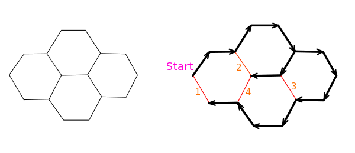
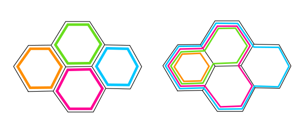
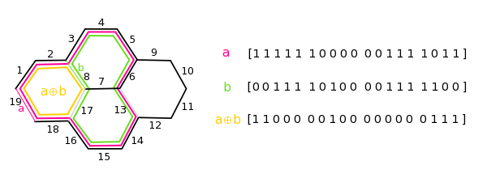
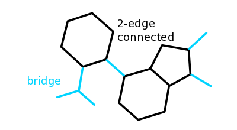

### 環の検出

化学構造における環(ring, cycle)は、分子グラフの閉路(cycle)に相当します。グラフを探索する(ある一点のノードから隣接ノードを順番に辿って他の全てのノードへの経路を出力する)とそのグラフが閉路を持つかどうかを知ることができます。既に到達したノードに別の経路から到達することができればそのグラフには閉路があります。

💡ここでは、同じノードを２回以上通らない単純閉路(simple cycle)を単に閉路と呼びます。スピロ環のような構造は2つの閉路が1つのノードで接しているとみなします。

上図の図は閉路を持つグラフに深さ優先探索(Depth first search, DFS)を行った例です。黒矢印で示した経路は、元のグラフと同じノード集合、および元のグラフのエッジ集合の部分集合から成り、かつ閉路を持たない連結グラフです。これをスパニングツリー(spanning tree)と呼びます。

グラフにある閉路の数は、スパニングツリーに含まれないエッジの数と等しくなります。上図の例では橙色で示した4つのエッジが該当するので、4つの閉路があることになります。閉路の数はcircuit rankとも呼ばれます。

📗探索が1段階進むごとに探索済みのノードとエッジが一つずつ増えるので、連結グラフのスパニングツリーのエッジの数はノードの数-1になります。よって、circuit rankは[エッジの数] - [ノードの数] + [連結成分の数]の式でも求めることができます。

📗スパニングツリーの生成はDFSでもBFSでも可能ですが、それぞれの閉路を構成するノードのリストを得たい場合は、閉路を検出した際に遡ってノードを記録することが容易なDFSが採用されます。

### Smallest set of smallest rings (SSSR)

これで環の個数は判明しましたが、多環式化合物のグラフを構成する経路の組み合わせはスパニングツリーのルートノードの選び方や探索方法によって大きく異なります。見た目の印象としては4つの六員環構造からなる下図左の組み合わせを得たいと考えるのが自然ですが、下図右のような組み合わせが得られる可能性もあります。

分子グラフにおいては、環を構成するノード数の総計が最小になるような環の選び方が実用上好ましいと考えられています。このような組み合わせはSmallest set of smallest rings (SSSR)として知られています。SSSRの計算にはグラフの辺の重みを１としてminimum weight cycle basisを計算するアルゴリズムが利用できます。Hortonの方法や[[Coelho de Pina, 1995]](https://dare.uva.nl/search?identifier=93573ea1-c3ea-4321-a479-294c74b7f0bb)[[Kavitha et al., 2008]](https://doi.org/10.1007/s00453-007-9064-z)などが知られています。

💡SSSRは化学的な性質を示唆しません(例:ポルフィリンの18$\pi$芳香環はSSSRに含まれない)。外平面グラフでない分子グラフはしばしば化学者の直感から外れたSSSRを生成します(例:キュバンの立方体構造はグラフ理論上は一つの面がない凹型の箱のように扱われる)。

閉路に含まれるエッジは1、含まれないエッジを0として、エッジ集合に対応させたビット列により閉路を表現することができます。グラフ全体としては長さがエッジ集合のサイズに等しいビット列を、閉路の数と同数持つことになります。このベクトル空間をfundamental cycle basisと呼びます。これらのビット列の間で排他的論理和をとると、2つの閉路が共有するもう一つの閉路になります(下図)。閉路の総数は決まっているので、既に検出されている大きい閉路を新しく検出されたより小さい環で更新していくことによりMinimum weight cycle basisを得ます。

📗Minimum weight cycle basisを得るアルゴリズムは、mはエッジ数、nはノード数としたとき、現状効率的なものでも$O(m^2n)$と地味に計算コストが高いです[[Kavitha et al., 2008]](https://doi.org/10.1007/s00453-007-9064-z)。

### 多環式化合物のトポロジー

多環式化合物(polycyclic compound)のトポロジーは環と環の接合のしかたによって以下の4通りに分類されます。

- 環と環が原子を共有していない
- 環と環が原子を1つのみ共有している -> スピロ環(spiro ring)
- 環と環が原子を2つ共有している -> 縮合環(fused ring)
- 環と環が原子を3つ以上共有している -> 架橋環(bridged ring)

つまり、環を構成するノード集合のintersectionのサイズで分類されます。

articulation pointとbridge

biconnected component スピロ以上
2-edge connected component 縮合以上

### Bemis-Murcko scaffold

環のトポロジーは医薬候補化合物の生理活性や有機合成戦略に大きく影響するファクターです。

として知られるような、縮合した環の構造(fused ring)は生理活性や易合成性の観点から創薬においてしばしば注目されます。このような部分構造は、グラフとしてみると全てのノードが２つ以上のエッジで繋がっているので、2-edge connected componentと呼ばれます。どのエッジを一か所だけ切断しても２つ以上のコンポーネントに分解されない部分グラフ、とも言えます。

逆に、一つのエッジを切断すると２つ以上のコンポーネントに分解される場合、そのエッジを橋(bridge)と呼びます。橋はHopcroft-Tarjanアルゴリズムの応用で検出できます（下記リンク参照）。元のグラフから橋を取り除くことで2-edge connected componentが残ります。

Hopcroft-Tarjanのアルゴリズム(Biconnected component - Wikipedia)
https://en.wikipedia.org/wiki/Biconnected_component

### 縮合環のデュアルグラフ
