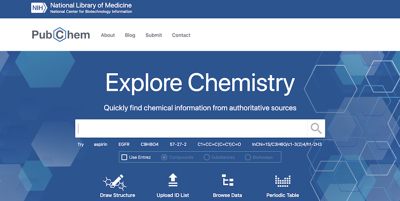
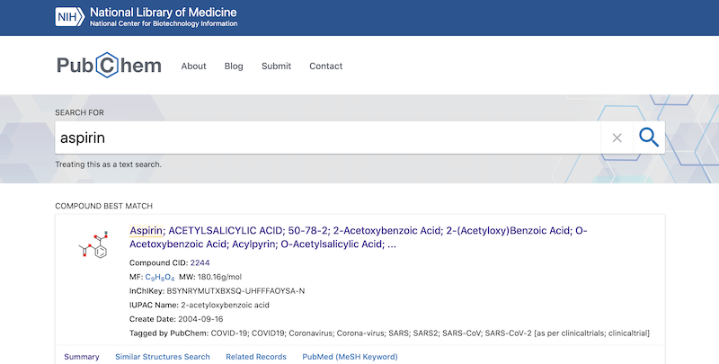
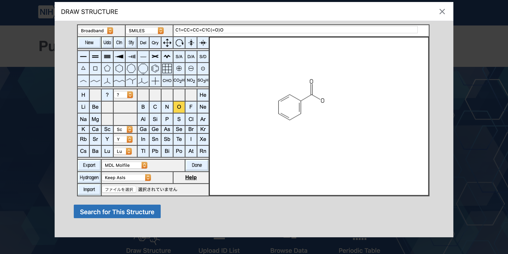

化学に関する情報として取り扱う学問、ケモインフォマティクス(chemoinformatics)の基礎的な概念の一つである、分子グラフ(molecular graph)モデルについての解説です。

### 化学のデータを扱う

ある試薬を購入したい時(あるいは購入可能かどうか知りたい時)、我々は試薬メーカーのオンラインカタログにアクセスして目的の試薬を検索します。また、発見した化合物が既に報告されていないか確認するために、文献データベースにアクセスして、関連する文献の情報を収集します。このように、化学に携わる人々は、常に何らかの化学情報を取り扱っています。

ケモインフォマティクス(chemoinformatics, cheminformatics)あるいは化学情報学とよばれる分野では、化学に関するデータを効率よく取り扱うために、以下のような研究に取り組みます。

1. 化学データの解釈とモデル化

   波動関数の重ね合わせで表現される分子の複雑な状態を、取り扱いやすいデータ構造に変換する。

1. 化学的、生化学的性質の予測

   モデル化した化学データに多変量解析等の解析手法を適用して、既知のデータから未知の物理的性質および生理活性を予測する。

1. データベースの設計と運用

   膨大な量の化学データを効率よく記憶装置に格納し、それらの正確かつ高速な検索手法を提供する。

### 化学データベース

手軽にアクセスできる化学データベースの例としては、各国の研究機関が運営している化学情報データベースや、試薬メーカーのオンラインカタログがあります。ここでは例として、アメリカの国立衛生研究所(NIH)の機関が運営しているPubChemというデータベースを利用してみます。

PubChem  
https://pubchem.ncbi.nlm.nih.gov/

PubChemにアクセスし、検索窓に化合物名を入力して検索します(検索窓の下に表示されている検索クエリの例を試すことができます)。検索にヒットしたレコードを選択すると、化学構造や物性などの詳細なデータが表示されます。

化学データベースのレコードは、以下のような情報で構成されます。

- 化学式

  分子がどの元素で構成され、それぞれの原子と原子の間にどのような化学結合があり、どのような位置関係になっているか。構造式、分子式、組成式など。

- 物性

  化合物が示す性質。実験によって得られた、あるいは計算によって予測された、沸点、融点、分配係数(水、油への溶けやすさ)、旋光度、モル質量、光学スペクトルなど。

- 名前、識別子

  化合物の名前、あるいは化学データベースにおいて化学物質を識別するID。歴史的経緯により広く用いられている慣用名、一定の命名規則に従ってつけられる系統名、Chemical Abstract Serviceに登録された化合物のIDであるCAS番号など。

- 生理活性

  化合物が生体にどのような影響を与えるか。薬効や毒性の強さ、その作用機序など。

- 安全性、法規制

  化合物の毒性、腐食性、可燃性、環境への負荷等、化学物質が生物および社会に与える影響に関する情報。およびそれらの懸念により化学物質の所持、譲渡、使用に際して課せられる法的な制限。

### 化学構造検索

多くの化学データベースには、化学構造による検索機能が実装されています。例えばPubChemの場合、検索窓の下にあるDraw structureのアイコンから構造式エディタを開き、描画した構造式と完全に（あるいは部分的に)一致する化合物を検索することができます。

化学構造の一致をコンピュータで検出することは見た目ほど単純ではありません。分子の構造は原子の数と種類だけで決まるものではなく、原子と原子の結合の仕方によって様々な形状をとるからです(下記は、C5H10の分子式を持ついくつかの分子の例)。

このような環状構造や分岐構造など、物体が持つ形状の概念を数学の用語でトポロジー(topology)と呼びます。構造異性体(structural isomer)とは、ある分子と分子式が同じ(化合物を構成する元素の種類と数が同じ)であり、かつトポロジーが異なる分子のことです。上記分子は全て互いに構造異性体の関係にあります。

### 分子グラフモデル

分子のトポロジーを表現するデータ構造として、分子グラフ(molecular graph)がしばしば用いられます。ここで言うグラフとは、頂点(ノード、node)とそれらを結ぶ辺(エッジ、edge)から構成されるデータ構造のことです。

グラフ(データ構造) - Wikipedia  
[https://ja.wikipedia.org/wiki/%E3%82%B0%E3%83%A9%E3%83%95_(%E3%83%87%E3%83%BC%E3%82%BF%E6%A7%8B%E9%80%A0)](https://ja.wikipedia.org/wiki/%E3%82%B0%E3%83%A9%E3%83%95_(%E3%83%87%E3%83%BC%E3%82%BF%E6%A7%8B%E9%80%A0))

分子をグラフとしてみると、原子をノード(node)、結合をエッジ(edge)と置くことができます。それぞれのノードとエッジにはラベル(label)あるいは属性(attribute)などと呼ばれる情報を付与することができます。ノードに関する情報としては、元素記号(あるいは原子番号)、電荷、スピン多重度あるいは不対電子の数、質量などが挙げられます。一方、エッジに関する情報としては、結合次数が挙げられます。

💡有機化学における構造式と同様に、水素はしばしば省略されます。

原子のノードを結合のエッジで接続した分子グラフは非常に単純なデータ構造ですが、特に低分子有機化合物を扱う創薬化学の分野において広く利用されています。

このモデルのグラフとしての特徴を以下に挙げます。

- 無向グラフ(undirected graph)

  分子グラフは一般的にエッジに向きが無い無向グラフとして表現されます。ちなみに、エッジに向きがある（一方通行の経路が存在する）グラフは有向グラフ(directed graph)と言います。

- 単純グラフ(simple graph)

  分子グラフは一般的にループ(self-loop、同一ノードを接続するエッジ)を持ちません。また多重辺(multi-edge、２つのノードの間に２本以上あるエッジ)を持ちません。ループと多重辺を持たないグラフを単純グラフと呼びます。

- 有限グラフ(finite graph)

  ノード数が無限ではないグラフを有限グラフと呼びます。ノード数が無限であるグラフは無限グラフ(infinite graph)です。

分子グラフは分子のトポロジーの取り扱いを容易にしますが、適用範囲には限りがあります。

- ホウ素化合物の三中心二電子結合など、非古典的な結合の中には単純グラフでは表せない化学構造が存在します。

- 実際の分子は電荷や多重結合をそれぞれの原子や結合が離散的に(discrete)持っているわけではなく、複数の原子や結合にまたがる連続的な(continuous)分布として持っています。例えば芳香族性もヒュッケル則に従って単純に「ある」か「ない」かを決められるわけではなく、実際には「弱い芳香族性」を持つような化合物も数多く存在します。

- 経験的には、分子グラフが適用されうる範囲は主に有機低分子化合物です。有機高分子や無機化学を取り扱う場合は、用途に応じてより適切なモデルを利用する必要があります。

📗化学構造式は各種スペクトル分析によって実験的に決定することが可能ですが、電荷や電子密度の連続的な分布を直接観測することは現代においても非常に困難です。有機化学者は様々な経験則や実験結果に基づいて、電子の非局在化(delocalization)という概念で化学構造式を拡張することにより、現実の分子の状態と化学反応機構の解釈を試みます。近年では分子軌道シミュレーションの発達により、経験則よりも正確に電子密度の分布を予測することができるようになりました。

### 分子グラフの統計的特徴

原子がとりうる結合の数(価数、valence)には限りがあるため、実用上取り扱う低分子有機化合物の分子グラフには次のような傾向があります。

- ノードの次数は1-4

  あるノードに接続するエッジの本数のことをそのノードの次数(degree)と呼びます。有機元素(C,H,O,N,P,S,ハロゲン)の価数は1から4の間にあるので、分子グラフのノードの次数の分布は1から4の間に集中します。遷移金属の配位や超原子価分子などで４を超えることもありますが、稀です。

- ほぼ全ての分子グラフが平面グラフ

  平面グラフ(planar graph)とは、平面上にグラフを配置した際にエッジが交差しないノードの配置が少なくとも一つ存在するグラフです。テトラへドランやフラーレンは立体的に見えますが、平面グラフです(下図および[C60のシュレーゲル図(Wikipedia)](https://en.wikipedia.org/wiki/Fullerene#/media/File:Graph_of_60-fullerene_w-nodes.svg)参照)

- その中でも外平面グラフが多い

  外平面グラフ(outerplanar graph)とは、平面グラフの中でも特に全てのノードがグラフの外縁に位置するようなグラフです。

ノードの次数が1-4のグラフは、比較的疎なグラフ(sparse graph)と言えます。グラフの主な実装方法としては隣接行列とマッピング（Pythonで言うところのDict）があるのですが、疎グラフは通常マッピングで実装されます。

グラフを扱う数学的な問題の中には天文学的な計算量になりうるものもありますが、扱うグラフの対象を平面グラフ、外平面グラフ等に限定すればより効率的なアルゴリズムが発見されることもあるため、この分野における重要なアプローチの一つとなっています[[Akutsu et al., 2013]](http://dx.doi.org/10.5936/csbj.201302004)。

📗次数が低く、立体障害など空間的な制約もあるので、非平面の分子グラフは極めて稀です。おそらく天然低分子としては存在せず、狙って合成する必要があります。なお、実際に非平面グラフ分子の合成報告があります[[Simmons et al., 1981]](https://doi.org/10.1016/0040-4039(81)80077-9)。
