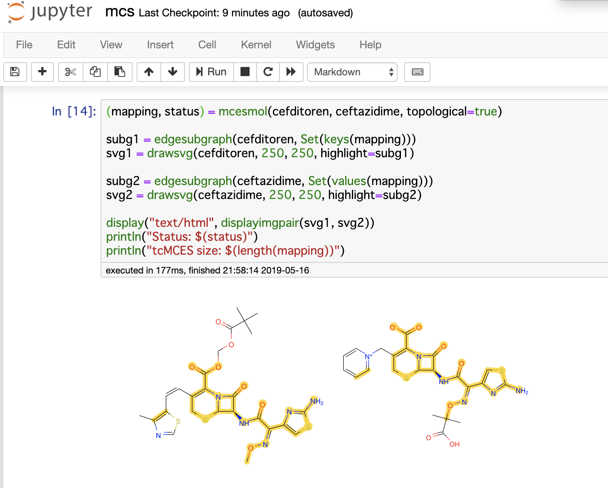
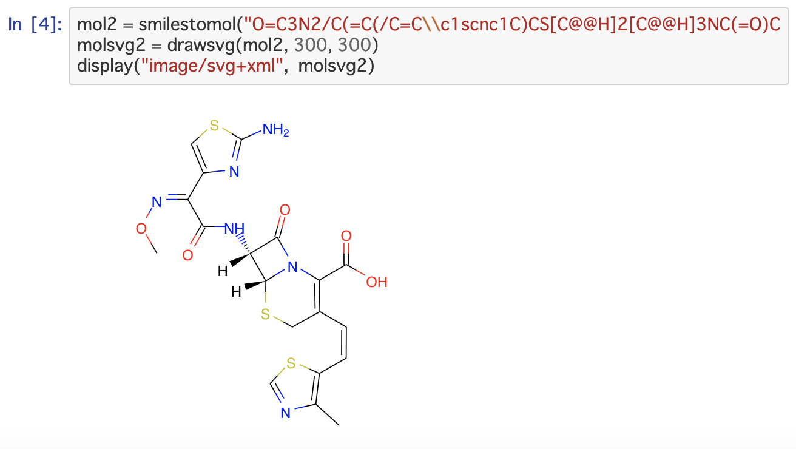
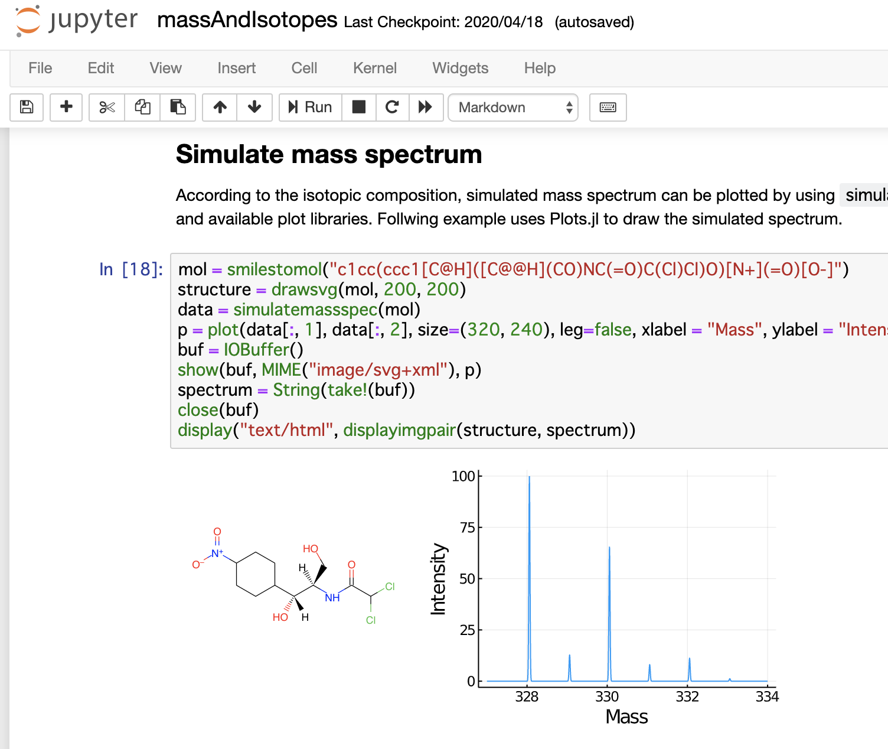
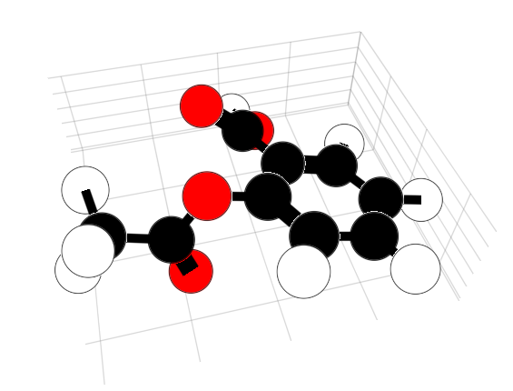
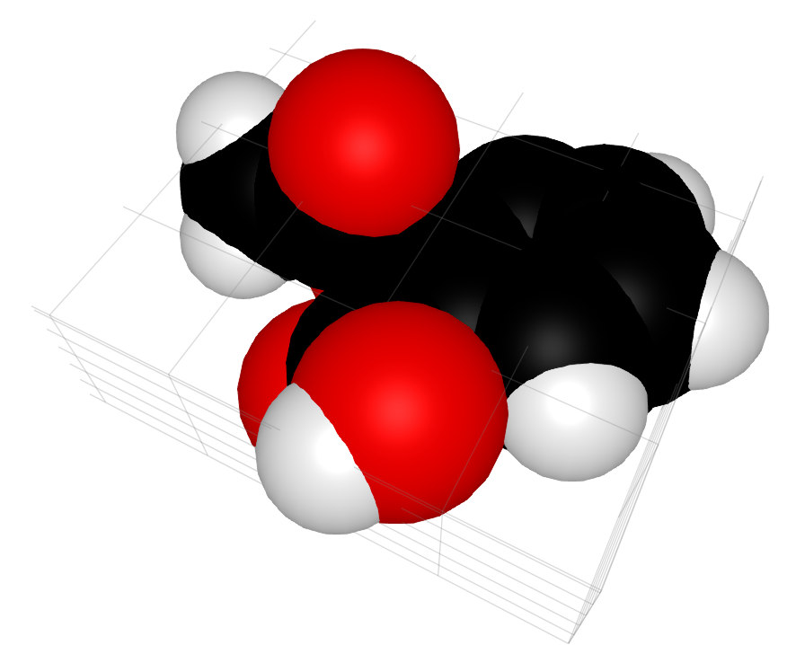

[創薬 (dry) Advent Calendar 2020](https://adventar.org/calendars/5119) 14日目の記事です。

MolecularGraph.jlというJuliaパッケージの最近のアップデートについてです。下記リンクは開発開始当初の2年前の記事になります。

Juliaでケモインフォマティクス - Qiita
https://qiita.com/mojaie/items/8986cb71502ec8a354f5

半年ほど別の業界で仕事をしていたので開発を中断していたのですが、以前の仕事に復帰できたので、最近また開発を再開しました。

### MolecularGraph.jl

Pythonで言うところの[RDKit](http://rdkit.org/)の簡易版のようなものです。総合的汎用的なケモインフォマティクス用ツールキットというよりは、グラフ同型(部分構造、MCS)やトポロジーなど、分子グラフの取り扱いに特化しています。

- 化学構造データファイルの入出力
- 構造式描画
- シリアライゼーション(InChI、JSON)
- 基本的な記述子(ドナー、アクセプター、芳香環など)
- 分子グラフ探索、トポロジー分析
- グラフ同型性(部分構造検索、MCS)
- 官能基分析

### チュートリアル

Jupyter Notebookのチュートリアルです。

MolecularGraph.jl\_notebook  
https://github.com/mojaie/MolecularGraph.jl_notebook

### coordgenlibsとInChI

[coordgenlibs](https://github.com/schrodinger/coordgenlibs)と[InChI](https://www.inchi-trust.org/)をJulia用のパッケージリポジトリに登録したので、MolecularGraph.jlから使えるようになりました。これによりSMILESの2D座標生成やInChIが利用できるようになりました。

Julia1.3以降のArtifactシステムは本当によくできていて、Cのライブラリなどを簡単にJuliaパッケージとして使うことができます。

C/C++のライブラリをJuliaのパッケージとして登録する(Julia 1.3以降)
https://mojaie.github.io/julia-package-binary/

### 質量分析関連

マススペクトルのピークシミュレーションができます。

### 3D表示

最近Tim Holy氏によって分子の3D表示が実装されています(基本的なCIの整備などいろいろ御指南をいただいており大変ありがたいです...)。  
https://github.com/mojaie/MolecularGraph.jl/issues/46

[Makie.jl](http://makie.juliaplots.org/stable/)でぐりぐり動かせます。すごい。

### 今後

これからも本業の合間に少しずつ開発を続ける予定です。
MolecularGraph.jlに、Julia言語に、ケモインフォマティクスに興味のある方、ぜひ一緒に開発しましょう。